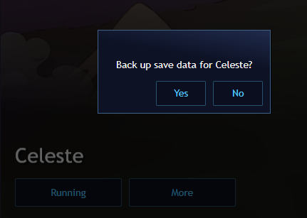
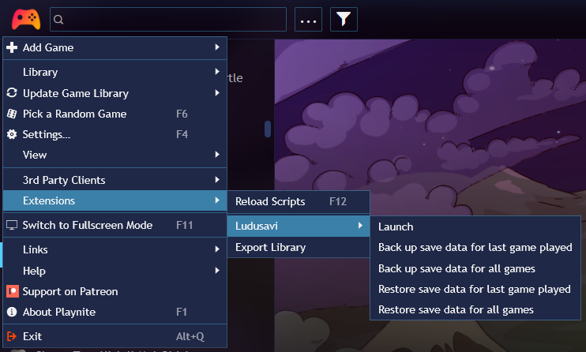
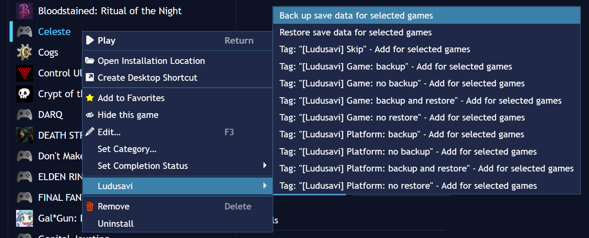
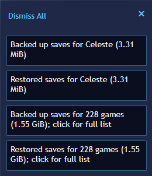
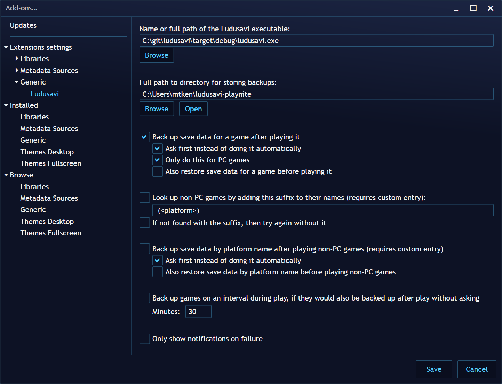

# Ludusavi for Playnite

**Playnite plugin to back up your save data using Ludusavi**

Known save locations for more than 10,000 games. On-demand backup and restore for all saves. Automatically back up a game when you finish playing it and even periodically during play.

---

## Table of Contents

- [Features](#features)
- [Screenshots](#screenshots)
- [Setup](#setup)
- [Configuration](#configuration)
- [Tag Management](#tag-management)
- [Other Notes](#other-notes)
- [Development](#development)
- [License](#license)

---

## Features

### Save Data Management
| Feature | Description |
|---------|-------------|
| **Comprehensive Database** | Known save locations for more than 10,000 games |
| **On-Demand Backup** | Backup and restore saves on demand for all games |
| **Automatic Backup** | Automatically back up a game when you finish playing it |
| **Periodic Backup** | Backup periodically during play at configurable intervals |
| **Background Operations** | All backup and restore operations run in the background |
| **Notifications** | Playnite notifications when operations complete |

### Game Recognition
| Feature | Description |
|---------|-------------|
| **Steam ID Support** | Uses Steam ID for Steam games when available |
| **Title Matching** | Matches games by title |
| **Normalized Title** | Optional normalized title matching (e.g., "Some Game: Special Edition (2022)" → "Some Game") |
| **Multiple Fallbacks** | Tries multiple methods to find games in Ludusavi database |

### Platform Support
| Feature | Description |
|---------|-------------|
| **PC Games** | Full support for PC games with known save locations |
| **Non-PC Platforms** | Support for custom entries for non-PC games (emulators, consoles) |
| **Platform-Specific** | Option to back up save data by platform name |
| **Custom Entries** | Create custom Ludusavi entries for games not in the database |

---

## Screenshots

### Prompt after exiting a game
> 

### Main menu actions
> 

### Game menu actions
> 

### Notifications
> 

### Settings
> 

---

## Setup

### Ludusavi

**You must download and install Ludusavi itself in addition to this plugin.**

Refer to the [Ludusavi project](https://github.com/mtkennerly/ludusavi) for instructions on how to install Ludusavi itself.

- **Recommended**: Ludusavi 0.24.0 or newer for full functionality
- **Minimum**: Version 0.7.0 or newer (albeit without some features enabled)

By default, the plugin will look for the Ludusavi executable in your `PATH` environment variable, but you can also configure the plugin with the full path to the executable.

### Plugin

You can download the plugin from the [releases page](https://github.com/mtkennerly/ludusavi-playnite/releases).

There are two ways to install it:

#### Using the `.pext` file:
1. Download `ludusavi-playnite-v*.pext`
2. Drag and drop the file into Playnite

#### Using the `.zip` file:
1. Download `ludusavi-playnite-v*.zip`
2. Extract it into a subfolder of the Playnite extensions directory
   (e.g., `C:/Users/<YOUR_NAME>/AppData/Local/Playnite/Extensions/Ludusavi`)

### Configuration

The plugin provides some of its own configuration (see the screenshots above), but you'll also need to open Ludusavi to configure it as needed.

For example, at this time, the plugin is not able to tell Ludusavi about your Playnite library sources, so you'll need to configure Ludusavi's roots separately.

---

## Tag Management

Behavior can be overridden for specific games by using tags:

| Tag | Back up after play | Restore before play | Back up non-PC platform before play | Restore non-PC platform after play |
|-----|-------------------|---------------------|-------------------------------------|------------------------------------|
| `[Ludusavi] Skip` | No | No | No | No |
| `[Ludusavi] Game: backup` | Yes, without asking | | | |
| `[Ludusavi] Game: backup and restore` | Yes, without asking | Yes, without asking | | |
| `[Ludusavi] Game: no backup` | No | No | | |
| `[Ludusavi] Game: no restore` | | No | | |
| `[Ludusavi] Platform: backup` | | | Yes, without asking | |
| `[Ludusavi] Platform: backup and restore` | | | Yes, without asking | Yes, without asking |
| `[Ludusavi] Platform: no backup` | | | No | No |
| `[Ludusavi] Platform: no restore` | | | | No |

### Tag Precedence

- `[Ludusavi] Skip` takes precedence over the other tags
- The `no` tags take precedence over their positive counterparts
- If the global backup-after-play option is enabled, but a game is marked with `[Ludusavi] Skip`, then it will not be backed up after play
- However, the game will still be included when doing a full backup of all games from the menu

### Informational Tags

The following tags are only informational and do not have special behavior:

- `[Ludusavi] Backed up`
- `[Ludusavi] Unknown save data`

---

## Other Notes

### Operation Behavior

- The backup and restore operations run in the background after you start them
- You'll get a notification in Playnite when they finish
- If you try to start another operation before the first one finishes, you'll have to wait

### Game Lookup

When processing specific games via the context menu, the plugin will try to look them up a few ways, in this order of precedence:

1. **Steam ID** (if applicable)
2. **Title**
3. **Normalized title** (if enabled in the plugin settings)
   - For example, "Some Game: Special Edition (2022)" normalizes to just "Some Game"

Playnite and Ludusavi don't always use the same name for each game, so that's why these fallbacks are needed. If a match is found with a different name than in Playnite, then the notification will include `Playnite Title (↪ Ludusavi Title)`.

### Full Backup/Restore Results

After doing a full backup/restore of all games, you can click the notification to see the list. There:
- **"+"** denotes a newly found game
- **"Δ"** denotes a game whose saves have changed

### Backup Merging

For backups, the plugin always sets Ludusavi's `--merge` flag. This way, if you back up saves for one game, it will not interfere with any backups you may have for another game.

### Non-PC Games

Although Ludusavi only knows about PC games by default, you can add custom entries in Ludusavi for non-PC games if you'd like. The plugin provides a setting to either look up those custom entries:

- **By the game's name** on its own
- **With a suffix** (in case you need multiple custom entries for the same game name on different platforms)

Within the suffix, you can write `<platform>` and it will be replaced by the actual platform name. For example, if you enable the default suffix and you'd like a custom entry for `Some Game` on Nintendo 64, then in Ludusavi you would create a custom entry called `Some Game (Nintendo 64)`.

### Platform-Wide Backups

If you want a single custom entry for all games on a particular non-PC platform (such as when all of the saves for that platform are in a single memory card file), you can enable the **"back up save data by platform name"** setting. You will just need to create a custom entry in Ludusavi with the same name as the platform.

### Data Source

The [info on what to back up](https://github.com/mtkennerly/ludusavi-manifest) is ultimately sourced from [PCGamingWiki](https://www.pcgamingwiki.com/wiki/Home), so please contribute any new or fixed data back to the wiki itself, and your improvements will be incorporated into Ludusavi's data as well.

### Translations

If you'd like to help translate this plugin into other languages, [check out the Crowdin project](https://crowdin.com/project/ludusavi-playnite).

---

## Development

Please refer to [CONTRIBUTING.md](./CONTRIBUTING.md) for development guidelines.

---

## License

Distributed under the [MIT](LICENSE) license.

---

## Author

**Matthew T. Kennerly** — [GitHub](https://github.com/mtkennerly)

---

## Links

- [Plugin Homepage](https://github.com/mtkennerly/ludusavi-playnite)
- [Ludusavi Homepage](https://github.com/mtkennerly/ludusavi)
- [Manifest Homepage](https://github.com/mtkennerly/ludusavi-manifest)

---

Made for Playnite to keep your save data safe

